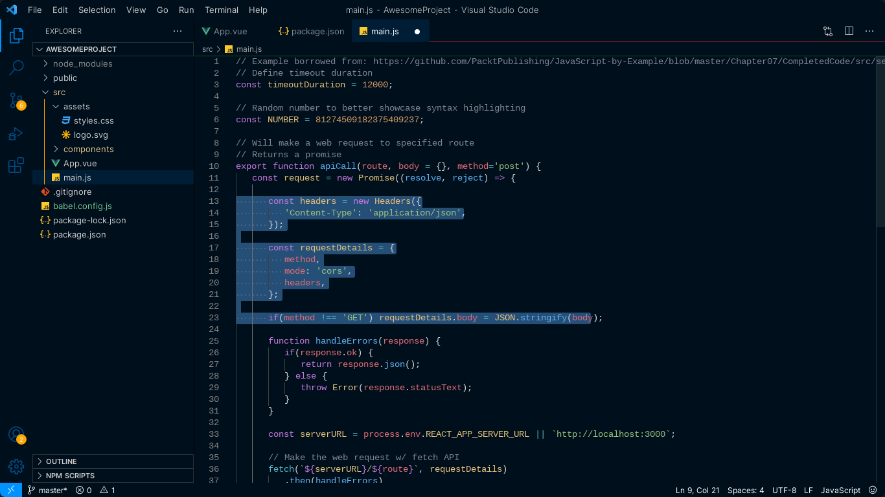

# Stellar Galaxy - Elevate Your Coding Experience

## Overview

Stellar Galaxy is a Visual Studio Code theme designed to elevate your code aesthetics to cosmic heights. Immerse yourself in a celestial palette, intuitive syntax highlighting, and customizable accents. Coding with style has never been so stellar!

## Features

- **Celestial Palette:** Enjoy a visually stunning theme inspired by the vastness of the cosmos. The color palette is carefully curated to provide a pleasant and immersive coding experience.

- **Intuitive Syntax Highlighting:** Easily distinguish between different code elements with carefully crafted syntax highlighting. Whether you're working on JavaScript, Python, HTML, or any other language, Stellar theme ensures clarity and readability.

- **Customizable Accents:** Tailor the theme to your preferences with customizable accents. Personalize your coding environment by adjusting accent colors to match your individual style.

- **Stylish UI Elements:** Stellar theme doesn't stop at code highlighting; it extends its elegance to the entire user interface. Experience a cohesive and visually appealing design across the entire Visual Studio Code interface.

## Installation

1. Open the Extensions view (`Ctrl+Shift+X` or `Cmd+Shift+X`).
2. Search for "Stellar Galaxy" and install it.
3. Select the theme by going to File > Preferences > Color Theme > Stellar Galaxy.

## Screenshots

## Contributing

If you have suggestions for improvements or would like to report a bug, please open an issue on the [GitHub repository](https://github.com/punesh12/stellar-galaxy).

We welcome contributions! If you'd like to contribute to Stellar Galaxy, please check our [contribution guidelines](/CONTRIBUTONG.md).

## License

This theme is licensed under the [MIT License](LICENSE).

---
**Elevate your coding experience to cosmic levels with Stellar Galaxy. Happy coding!**
